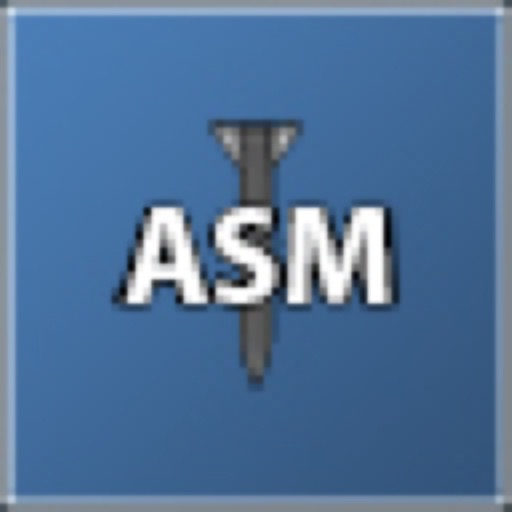

# TTT2 Air-To-Surface Missile

The Air-to-Surface Missile is an updated and optimized weapon for **[Trouble in Terrorist Town 2 (TTT2)](https://github.com/TTT-2/TTT2)**. Originally created by Otger, this modernized version ensures full compatibility with TTT2's mechanics, optimized rendering pipelines, and modernized networking. 

As a Traitor, you can call down an explosive air-to-surface missile from the sky. Use the mouse or movement keys to guide the missile down to your unsuspecting targets.

## Features
- **Controllable Missile**: Guide the missile with your mouse and movement keys.
- **Adjustable Speeds**: Hold `Shift` to move faster or `Alt` to move slower while guiding the missile.
- **Customizable Damage**: Set blast damage and radius via ConVars.
- **Safe Targeting**: Teammates are highlighted in blue to prevent accidental friendly fire.
- **TTT2 Native Integration**: Fully utilizes TTT2's standard systems.

## Installation
Since this is an addon designed for a server or local play, you can either:
1. Subscribe to the addon on the Steam Workshop.
2. Or download the files and place them in `garrysmod/addons/air-to-surface-missile`.

Counter-Strike: Source (CSS) content must be mounted for the original models and sounds. If CSS is not mounted, the SWEP will fall back to using the toolgun model.

## Configuration (ConVars)
The following ConVars are available for server owners to configure the behavior of the missile. These can be placed in `server.cfg` or adjusted in-game via the server console.

| ConVar | Default | Description |
|--------|---------|-------------|
| `ttt_asm_aim_time` | 15 | Time in seconds you have to aim the missile before it auto-launches. |
| `ttt_asm_missile_blast_damage` | 110 | The maximum damage the missile blast will deal. |
| `ttt_asm_missile_blast_radius` | 384 | The explosion radius of the missile blast. |
| `ttt_asm_mouse_speed_modifier` | 3 | Speed multiplier applied to the mouse movement during aiming. |
| `ttt_asm_shift_speed_modifier` | 2 | Movement speed multiplier during the aiming sequence while holding Shift. |
| `ttt_asm_alt_speed_modifier` | 0.25 | Movement speed multiplier during the aiming sequence while holding Alt. |
| `ttt_asm_allow_abort` | 1 | Allows the user to abort the aiming sequence (Right-click). |
| `ttt_asm_allow_abort_mid_flight` | 0 | Allows the user to abort after the missile has already launched. |
| `ttt_asm_allow_camera_move_mid_flight` | 1 | Whether the camera can still be moved after the missile is launched. |
| `ttt_asm_show_colleagues` | 1 | Highlights teammates in blue during the aiming sequence. |
| `ttt_asm_damage_owner` | 1 | Should the missile damage the person who fired it? |
| `ttt_asm_friendlyfire` | 1 | Should the missile damage the owner's teammates? |
| `ttt_asm_show_debug` | 0 | Shows debug information, including the missile blast radius on impact. |

## Troubleshooting
- **Missing Models / Textures**: Ensure Counter-Strike: Source is mounted on your server.
- **No Damage Being Dealt**: Check if `ttt_asm_friendlyfire` or `ttt_asm_damage_owner` is blocking the damage, or if another addon is interfering with `util.BlastDamage`.

## Credits
- **Original Author**: Otger
- **Modernization & TTT2 Port**: Florentin / REC2-net

## License
This project is licensed under the MIT License.